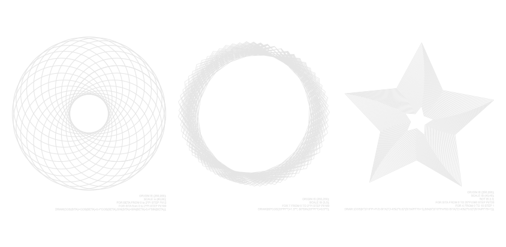
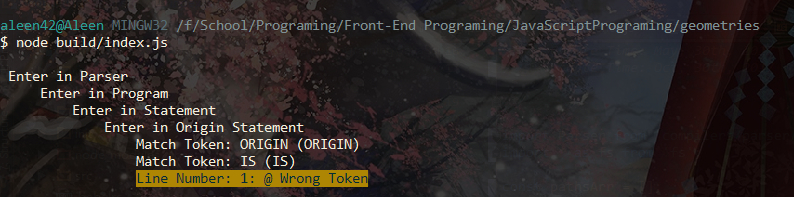
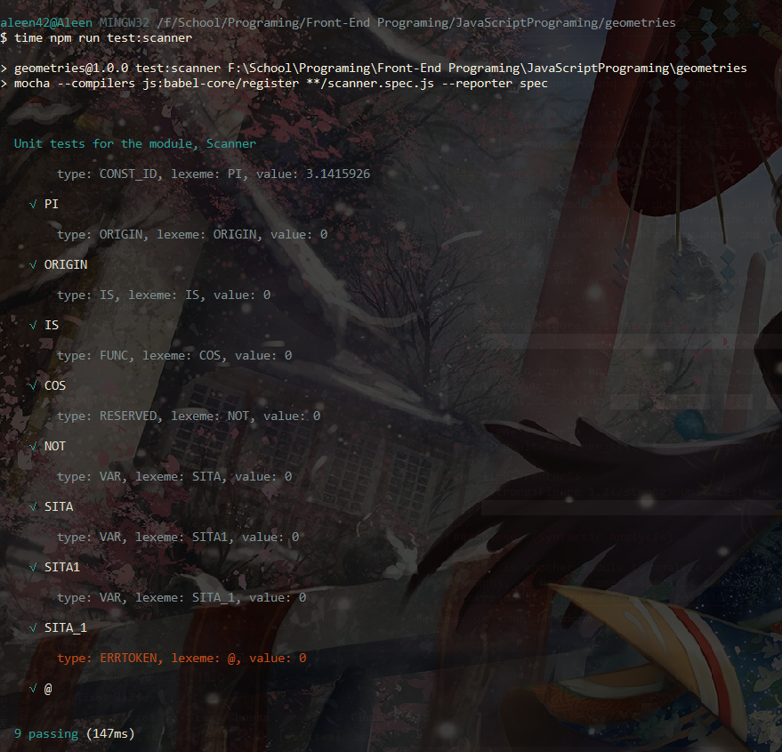
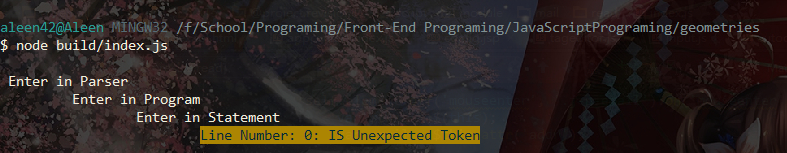
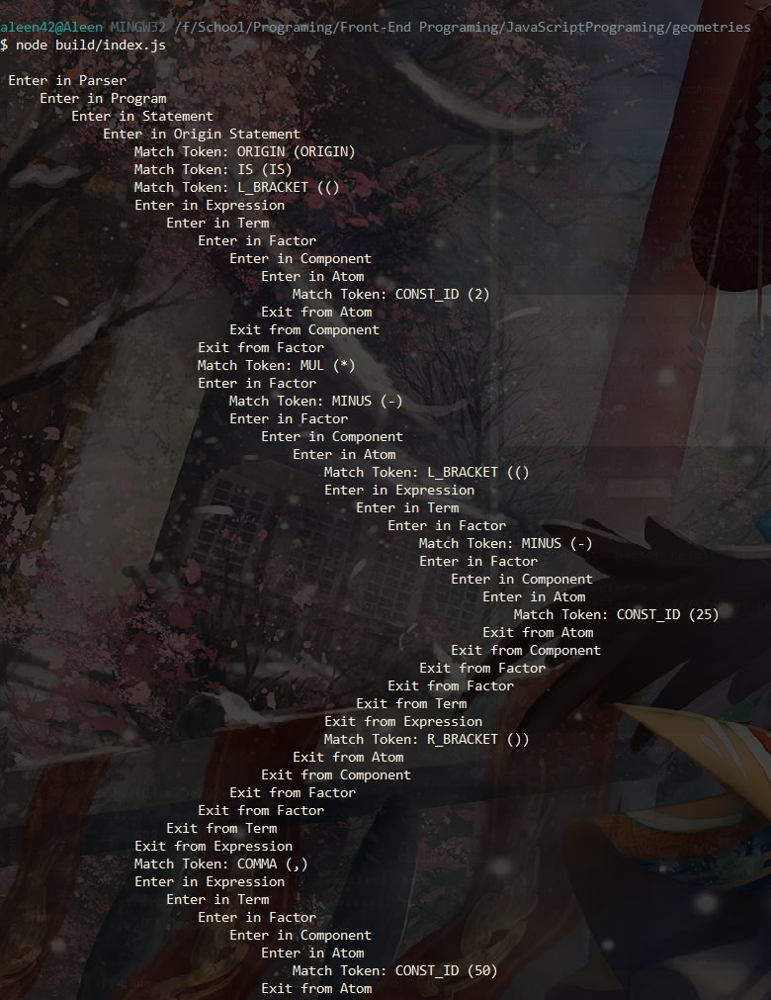
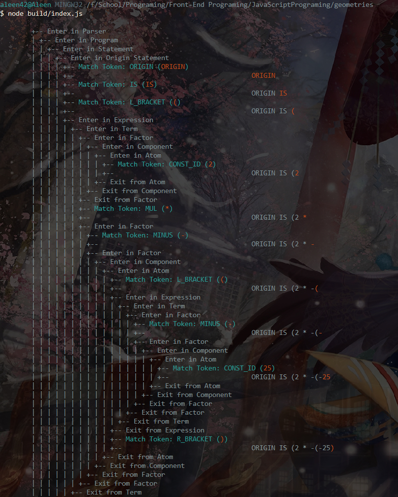

## Geometries

<p align="center">
    
</p>

[Here](https://geometries.aleen42.com/), you can check the demo directly.

### Usage

To generate some beautiful complicated picture:

```js
const pointsArr = [];
const pathsArr = [];

const str = `
ORIGIN IS (200, 300);
SCALE is (100, 100);
FOR BETA FROM 0 to 2 * PI STEP PI / 30
    FOR SITA from 0 to 2 * PI STEP PI / 180
        DRAW(
            COS(SITA) + COS(BETA) - 0.4 * COS(BETA),
            SIN(SITA) + SIN(BETA) - 0.4 * SIN(BETA)
        );
`;

const Parser = require('@aleen42/geometries');
new Parser(str, {
    drawingCallback: (x, y) => {
        pointsArr.push(x);
        pointsArr.push(y);
    },
    lineCompleted: () => {
        pathsArr.push(`<path fill="none" stroke="#000"
            stroke-width="1" stroke-linecap="round" stroke-linejoin="round"
            d="M${pointsArr.shift()},${pointsArr.shift()}L${pointsArr.join(' ')}"/>`);
        // reset storing points of each line
        pointsArr.splice(0, pointsArr.length);
    },
    drawingCompleted: () => {
        // create the picture with SVG formats
        fs.writeFileSync('stave.svg', '<svg '
            + 'xmlns="http://www.w3.org/2000/svg" '
            + 'xmlns:xlink="http://www.w3.org/1999/xlink"'
            + ' width="500" height="500">' + pathsArr.join('\n') + '</svg>', 'utf8');
    },
});
```

### TODO

- [ ] display syntax exceptions
- [ ] syntax highlight

### How it works

"Geometries" is mainly a JavaScript project for writing a drawing compiler to generate complicated geometries. Inspired by [the project](https://github.com/aleen42/FuncDrawCompiler) written before with C Sharp, and UI rendered by WPF, I hope it can be also completed as a module in JavaScript. Furthermore, vector graphics can also be an awesome feature especially when a designer hopes to use programs to generate into what they are similar to.

During designing this tool, you may find that it has firstly made used with the knowledge of "Principles of Compiler (編譯原理)" to design a new language, which belongs to graphical programming languages. With this brief language, you can easily tell the machine how to draw your geometries by using some syntax like the following snippet:

```
ORIGIN IS (380,140);
SCALE IS (100,100);
FOR T FROM 0 TO 50*PI STEP 0.1 DRAW(COS(T)+1/1.3*COS(1.3*T), SIN(T)-1/1.3*SIN(1.3*T));
```

To parse and understand such a language, we have to create a system containing three main parts:

 1. [x] Scanner (Lexical Analysis, 詞法分析)
 2. [x] Parser (Syntactic Analysis, 語法分析)
 3. [x] Semantic (Semantic Analysis, 語義分析)

#### Scanner (Lexical Analysis)

The Scanner is the module which duty is to scan through the whole sentence and figure out which word is a legal lexeme, while which one is not. For instance, in such a brief language, when you tell the engine to use the Scanner module to scan through your giving sentence: "ORIGIN IS @", the Scanner module will find out that `@` is not a legal lexeme in such a language, and throws out an error like this: `Line Number: 0: NOT Wrong Token`.

<p align="center">
    
</p>
<p align="center">
    <strong>Figure 1.1</strong> Wrong token
</p>

In order to have a unit testing of this module, I have also written some specification under corresponding folder, which is named with `scanner.spec.js`, and if you want to run this test, you can run the command `npm run test:scanner`. After that, the unit test framework will automatically run the script to test whether some words are legal, including `PI`, `ORIGIN`, `IS`, `COS`, `NOT`, some variables and an illegal character `@`:

<p align="center">
    
</p>
<p align="center">
    <strong>Figure 1.2</strong> Unit test for the Scanner module
</p>

#### Parser (Syntactic Analysis)

The Parser is another module to analyze whether a given sentence is meaningful and understood by the language engine. To specify the original position before generating graphs, we have to use a specific sentence to tell the engine like "ORIGIN IS (2 * -(-25), 50);", which means that the engine should start to calculate and generate corresponding graphs from the position (50, 50). What if you are telling the engine with "IS ORIGIN (2 * 25, 50);", the engine won't understand what you mean and throws out an error. This is what the Parser module has done.

How can it understand a sentence with specific grammar? It relies on a series of recursive calling, in which there should be some phases. Different phases are used to recognize different words in the sentence. Take "ORIGIN IS (2 * -(-25), 50);" as an example, the Parser module will firstly enter **Statement Phase**, and recognize that this sentence is a statement for specifying *ORIGIN* as it is given by the first word. If the module is given *IS*, it cannot recognize any statement for this word at all, so it should throw out an error to tell you this is an unexpected word.

<p align="center">
    
</p>
<p align="center">
    <strong>Figure 2.1</strong> <i>IS</i> is not an expected word
</p>

After recognizing that the sentence is trying to specify *ORIGIN*, and the Parser module will try to match two words in the next step: `IS` and `(`. Once matching the left bracket successfully, it will start to enter another phase named **Expression Phase**, in which the module should know whether the x-axis is given an understanding expression like `2 * 25`, `25 + 25`, or a number `50` only. In the current case, the module should get `2` in the **Atom Phase** firstly, and then, `*` has been matched during the **Term Phase**. So far has the module known that you need to calculate the x-axis value by multiplying a number by `2`. When trying to match another number, the engine has gotten a character `-` during **Factor Phase**, which means that another number should have a *MINUS* notation before it. Oh, there is another left bracket! The engine should be led into another **Expression Phase** ...

To make it simple, I have logged some milestones during entering each phase, and after a whole matching, the log can easily show how the Parse module works to parse a sentence given by you.

```js
const Parser = require('@aleen42/geometries');
console.log(new Parser('ORIGIN IS (2 * -(-25), 50);', {
    /** debug option is needed for logging */ 
    debug: true,
}).outputLog());
```

As shown in the snippet above, we can see that if we want to use the `outputLog` method after creating an `Parser` instance, we need to parse `true` value to the option `debug`. By running the code:

<p align="center">
    
</p>
<p align="center">
    <strong>Figure 2.2</strong> The log of parsing
</p>

To make it more colorful, you can implement another showing way like what the method `showColorfulResult()` does in `parser.spec.js`:

<p align="center">
    
</p>
<p align="center">
    <strong>Figure 2.2</strong> The colorful log of parsing
</p>

In conclusion, the Parser module will try to parse a given sentence with recursive calling during different phases to try to understand what the sentence means. As we can see in the above example, there are **EIGHT** phases:

 - **Parser Phase**: the entry of the module, in which the Scanner module will be used to read whole sentences
 - **Program Phase**: the program entry, in which the Parser module start to parse
 - **Statement Phase**: to parse *ORIGIN*, *SCALE*, *ROT*, and *FOR* statements
 - **Expression Phase**: to evaluate the value of an expression
 - **Term Phase**: to match arithmetic operations including *PLUS*, *MINUS*, *MUL*, and *DIV*.
 - **Factor Phase**: to match positive(`+`) or negative(`-`) notation
 - **Component Phase**: to match increment(`++`), decrement(`--`), or power(`^`) notation
 - **Atom Phase**: to match constants, variables, functions, or sub-expressions.

### Release History

* ==================== **1.0.0 Initial release** ====================

### :fuelpump: How to contribute

Have an idea? Found a bug? See [how to contribute](https://wiki.aleen42.com/contribution.html).

### :scroll: License

[MIT](https://wiki.aleen42.com/MIT.html) © aleen42
